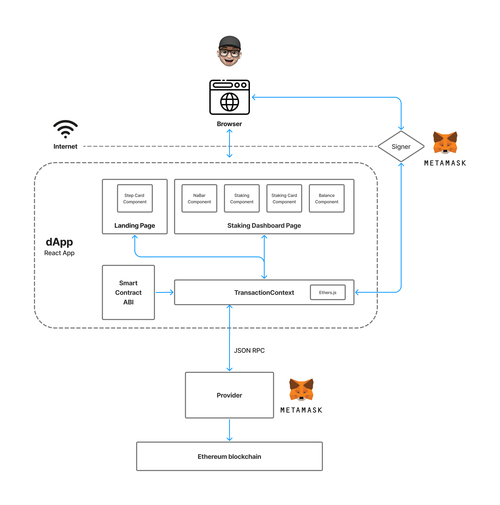

## Design Overview

## TransactionContext

Context provides a way to pass data through the component tree without having to pass props down manually at every level.
TransactionContext is used to send request to smart contract deployed on the ethereum blockchain.
